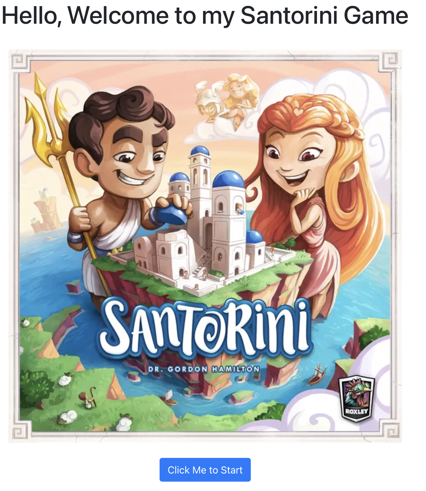
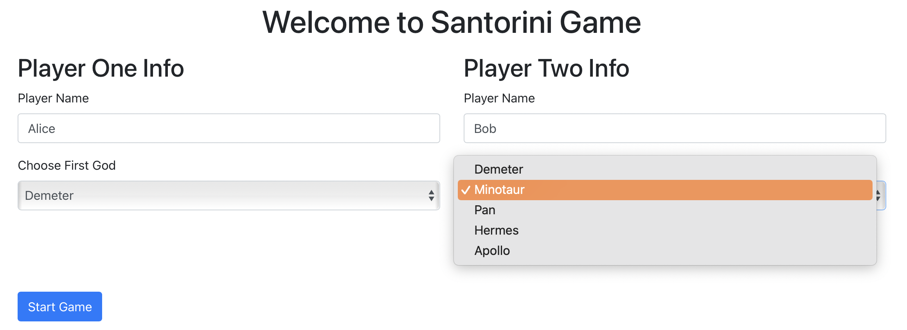
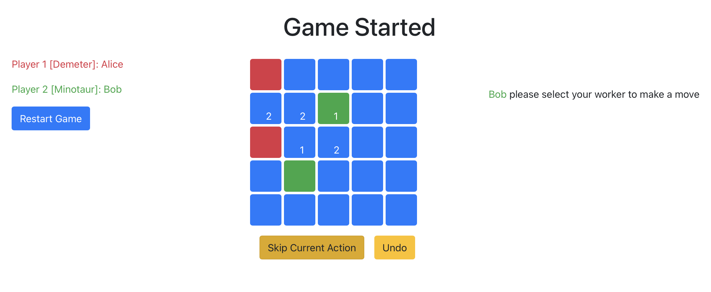

## How to run the program

To start the backend, in /backend folder, run:

```
mvn install
```

Them, navigate to the App.java file in backend/src/main/java/edu/cmu/cs214/hw3/server/App.java and run the main function in it.
This will start the Java server at [http://localhost:8080](http://localhost:8080/).

In /fontend foler, run:

```
npm install
npm start
```

This will start the frontend server at [http://localhost:3000](http://localhost:3000/).
In the web browser, click "Click Me to Start".
This will bring you to the /playerForm page where you can enter Player Names and choose God cards.
Then click "Start Game" will bring you to the /gameBoard page.
In this page, all 25 game cells, Restart Game, Skip Current Action and Undo buttons are clickable.

Enjoy the Game!

## Introduction of the program and the Santorini board game

This program is an implementation of _Santorini_ board game which support god cards and Undo feature.
Backend -- Java
Frontend -- typescript with react
Built and tested on github Action -- enable automatic testing with .github/workflows/main.yml file
You can access the rules of the game here: [https://roxley.com/products/santorini](https://roxley.com/products/santorini)

The game is played on a 5 by 5 grid, where each grid can contain towers consisting of blocks and domes. Two players have two workers each on any field of the grid. Throughout the game, the workers move around and build towers. The first worker to make it on top of a level-3 tower wins. Both players pick starting positions for both their workers on the grid. Players take turns. In each turn, they select one of their workers, move this worker to an adjacent unoccupied field, and afterward add a block or dome to an unoccupied adjacent field of their new position. Locations with a worker or a dome are considered occupied. Workers can only climb a maximum of one level when moving. Domes can only be built on level-3 towers. You can assume there are infinite pieces to play.

This program features four distinct endpoints: the home page, the player form page, and the gameboard page, and the winner page. Refer to the image provided below for a visual representation.



